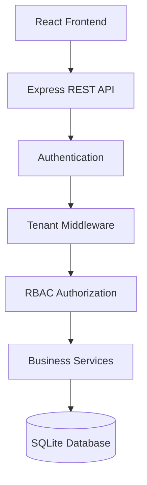
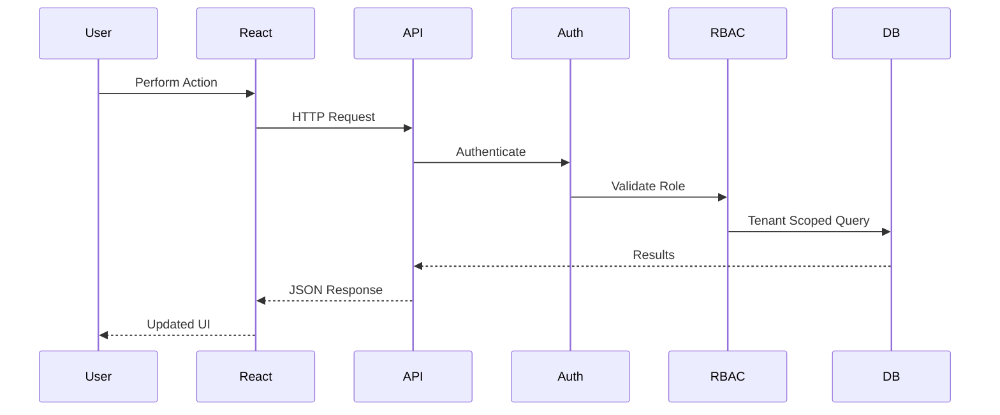

# 🏢 AgencyDesk

<p align="center">


</p>

<p align="center">

**Enterprise Multi-Tenant Agency & Client Collaboration Platform**

A production-ready SaaS platform that enables agencies to securely manage clients, projects, tasks, approvals, time tracking, and collaboration through isolated client portals.

</p>

---

# 🚀 Overview

AgencyDesk is an enterprise-grade **multi-tenant SaaS platform** designed for agencies managing multiple clients from a single deployment.

Instead of maintaining separate deployments for every agency, AgencyDesk serves multiple organizations through one application while ensuring **complete tenant isolation**, **role-based access control**, and **secure client collaboration**.

The platform demonstrates production-oriented backend engineering including secure authorization, scalable database design, middleware-driven access control, and automated security testing.

---

# 🎯 Why This Project?

Modern SaaS applications involve much more than CRUD operations.

They must solve real engineering challenges such as:

- Multi-tenancy
- Role-based authorization
- Client-specific visibility
- Secure file sharing
- Project collaboration
- Data isolation
- Scalable backend architecture

AgencyDesk demonstrates how these challenges can be solved using clean system design and production-ready engineering practices.

---

# ✨ Features

## 🏢 Multi-Tenant SaaS Architecture

Every agency operates within an isolated workspace.

Each tenant has completely separate:

- Users
- Clients
- Projects
- Tasks
- Files
- Time Entries
- Reports

Every API request is scoped using:

```sql
agency_id = tenant_id
```

ensuring complete tenant isolation.

---

## 🔐 Role-Based Access Control (RBAC)

AgencyDesk supports multiple permission levels.

| Role | Description |
|------|-------------|
| Agency Admin | Complete administrative access |
| Agency Member | Manage projects, tasks and files |
| Client User | Restricted client portal access |

Authorization is enforced entirely on the backend.

---

## 📋 Project Management

- Kanban Boards
- List Views
- Status Tracking
- Priorities
- Due Dates
- Assignees
- Internal Tasks

---

## 💬 Client Portal

Clients receive their own secure workspace where they can:

- View project progress
- Access client-visible tasks
- Leave comments
- Review deliverables
- Approve or reject files
- Request revisions

Agency-only resources remain hidden automatically.

---

## ⏱ Time Tracking

Track work across projects with:

- Logged hours
- Work notes
- Budget utilization
- Project effort reporting

---

## 📁 File Approval Workflow

Deliverables can be uploaded directly to tasks.

Clients may:

- Approve files
- Request changes
- Leave review notes
- Track approval history

---

## 📊 Project Dashboards

Real-time analytics include:

- Task Distribution
- Budget Usage
- Logged Hours
- Productivity Metrics
- Project Progress
- Client vs Internal Work

---

## 📝 Client Intake Forms

Convert prospects into active projects.

Each submission automatically creates:

- Client
- Project
- Workspace

---

## 🧪 Automated Testing

The project includes automated integration tests covering:

- Tenant Isolation
- RBAC Enforcement
- Client Visibility Rules
- Invite Idempotency
- Member Removal
- Cross-Tenant Access Attempts

---

# 🌟 Highlights

- ✅ Multi-Tenant SaaS Architecture
- ✅ Role-Based Access Control
- ✅ Secure Client Portals
- ✅ Project & Task Management
- ✅ Time Tracking
- ✅ File Approval Workflow
- ✅ Tenant Isolation Middleware
- ✅ Automated Authorization Tests
- ✅ Production-Oriented Backend Design

---

# 🏗️ System Architecture



---

# 🔄 Request Lifecycle



---

# 💻 Technology Stack

## Frontend

- React
- TypeScript
- Vite

## Backend

- Node.js
- Express.js
- SQLite

## Security

- Role-Based Access Control
- Tenant Middleware
- Authorization Guards

## Testing

- Automated Integration Tests

---

# 📂 Project Structure

```text
agency-desk/

├── server.ts
├── metadata.json
├── DESIGN.md
├── README.md

├── server/
│   ├── api.ts
│   ├── db.ts
│   ├── middleware.ts
│   └── seed.ts
│
├── src/
│   ├── App.tsx
│   ├── components/
│   └── types.ts
│
└── tests/
    └── run-tests.ts
```

---

# 🚀 Quick Start

## Install

```bash
npm install
```

## Start Development Server

```bash
npm run dev
```

Application runs at

```
http://localhost:3000
```

---

## Seed Demo Data

```bash
npm run seed
```

Creates:

- 2 Agencies
- Staff Members
- Client Users
- Projects
- Tasks
- Time Entries
- File Attachments

---

## Run Test Suite

```bash
npm run test
```

Verifies:

- Tenant Isolation
- Client Visibility
- Authorization
- Edge Cases

---

# 👤 Demo Accounts

| User | Role | Purpose |
|------|------|----------|
| Alex Rivera | Agency Admin | Full admin workflow |
| David Kim | Agency Member | Task & project management |
| John Smith | Client User | Client portal |
| Elena Rostova | Agency Admin | Second tenant |
| Lisa Wong | Client User | Client approvals |
| Sarah Jenkins | Multi-Role | Multi-agency switching |

---

# 🔒 Security Model

Every request passes through:

```
Authentication
        ↓
Tenant Validation
        ↓
Role Validation
        ↓
Resource Ownership
        ↓
Database Query
```

Internal resources are filtered before reaching client users, preventing accidental data exposure.

---

# 📈 Scalability

The architecture is designed for future production deployment.

Potential enhancements include:

- PostgreSQL
- Redis
- Object Storage
- Docker
- Kubernetes
- WebSockets
- Background Jobs
- CI/CD
- Audit Logging
- Notifications

---

# 📄 Design Documentation

Detailed architectural decisions, database schema, edge cases, and authorization model are documented in:

```text
DESIGN.md
```

---

# 👨‍💻 Engineering Focus

AgencyDesk demonstrates:

- Enterprise SaaS Architecture
- Multi-Tenant Database Design
- Secure Backend Engineering
- REST API Design
- Role-Based Authorization
- Full-Stack TypeScript Development
- Automated Testing
- Production-Oriented System Design

---

# 📄 License

This project was developed as a technical assessment demonstrating production-ready SaaS architecture, secure multi-tenancy, backend engineering, and scalable full-stack application development.
